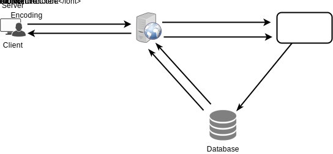
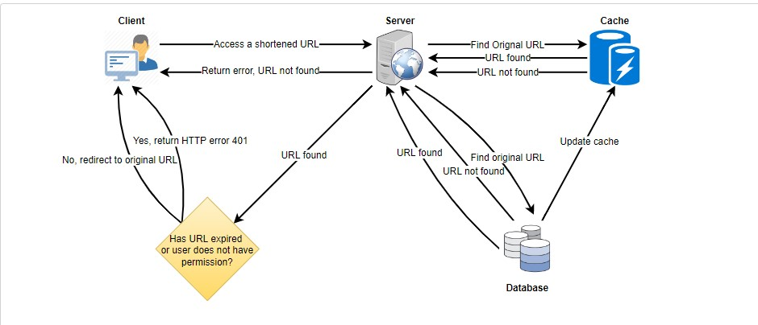
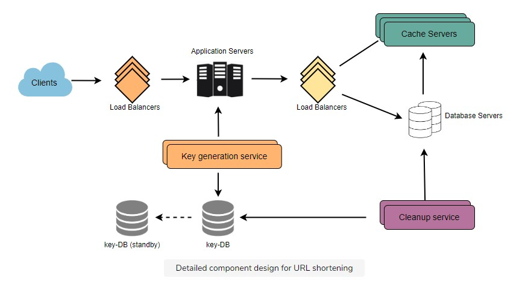

# Ganga_TinyURL

# System Design for TinyURL project: https://gangakarthik0315.github.io/Ganga_TinyURL/

## Requirement gathering (Funcitonal and Non-Functional):
### Functional Requirements:
- The service should be able to provide short link to the long URL.
- On accessing the short link the service should redirect to the original link
- Users can optionally provide the custom short link name
- Users should be able to provide the expiration time for the short link

### Non-Functional Requirements:
- The service should be highly available, otherwise all the redirections will fail
- Redirection should happen in real-time with minimal latency
- Short links should not be guessable

### Extended requirements:
- Analytics like how many times the link is redirected?
- Service should be accessible via REST APIs by other APIs

## Storage and Capacity estimations:
- Handy Formula : 1 month = 2.5 million seconds therefore, 1B transactions/month = 400 requests/s
- Our service is read heavy compared to write as, there will be many URL redirections than URL creations.
- Lets assume the read:write ration is 100:1

### Number of read and write requests per second:
- Lets assume there are 100M URL creation requests per month i.e., 100M / (30 * 24 * 3600s) = 40 URLS/s
- number of URL redirections = 40 * 100 = 4K URLS/s

### Storage estimation:
- Let's assume the average size of the short URL is 500 bytes and we are storing the links for 5 yrs.
- 100M * 500 * 12 * 5 = 3 TB
- Let's assume 20% of URLS create 80% traffic then caching 20% of hot URLs allows faster access.
- 4K URL/s = 4k * 24 * 3600 * (20%) = 35GB/day

### Bandwidth estimation:
- ingress is 40 URLS/s. 40 * 500 = 20KB/s
- outgress is 4K URL/s, 4k * 500 = 2MB/s

## Define system API (Public and Private endpoints):
- We can use SOAP or REST APIs to expose the functinality of our service.
 `CreateURL(api_key, original_url, custom_name=None, expiry_date=None, user_name=None)`
- A successful url creation returns the short_url
 `DeleteURL(api_key,short_url)`
- A successful url deletion returns "URL deleted" message

### service abuse:
- A malicious user can consume all the URLs. We can overcome the abuse by limiting the number of users via api_key. Each api_key limits the number of url creations and redirections per some time period

## Database Design (High level design):
- We need two tables to store the user deatils and the URL details
1) URL (hash:varchar(pk), original_url:varchar, user_id:int, creationDate:datetime, expirationDate:datetime)
2) User (user_id:int(pk), user_name:char, email:varchar, lastLogin:datetime)

Since we anticipate billions of rows to be created and there is no relationship between the objects a NoSQL db is a better choice which can also be easily scaled.

## Basic System Design and Algorithm.
- The basic requirement of our sytem is to generate a short and unique key for the given URL.

### Encoding a given URL:
- We can use a MD5 or SHA256 encoding algorithm as our hash function to generate a unique hash. The hash is then encoded to display.
- We can use base36[a-z 0-9] or base62[A-Z a-z 0-9] with few special characters like + and / we can use base64
- There are 4K * 3600s * 24hr * 365days * 5yr requests for the 5 yrs approx = 630B requests.
- If we use base64 encoding with 7 chars of short_key length we get approx 4 triilion unique keys which can easily suffice our request.
- If we use MD5 encoding algo it will return 128 bit has which then encoded will return more than 17 chars key.
- We can use the first 7 chars but it might cause duplication issue.
- There are a couple of issues with this approach.
- What if multiple users enter the same URL, all of them get the same short URL which is not acceptable
- what if parts of the URL are URL encoded. they remain identical except for the URL encoding
**Solution** : We can append the incrementing sequence number to the URLs to generate the short URL. However, this becomes an ever increasing number and the performance of the service reduces
- Another solution is to append the user_id to generate the short key. However if the user is not signed in then we may have to ask the user to choose the uniqueness key.Even after this if there is a duplication we have to keep generating the keys till a unique key is returned.

### Key Generation Service(KGS):
- KGS can be used to generate unique 7 letter short keys that can be stored in a database namely key-db.
- This approach is simple, fast and can eliminate duplication.
- The key-db will have two tables one for the available keys and one for the used keys. When a key is assigned to a requesting server it will be moved from available to moved table.
- When multiple servers are accessing the same key concurrently then KGS has to synchronize the data structure used to save the keys(like imposing a lock on the key) before removing the key and releasing it to the server.
- KGS can easily be a single point of failure as a result we have to have a standby replica of the KGS server to take control after the failover
- size of key db server 7 characters * (64^7) = 30 TB if a modern server has 4TB size then we may have to factor 8 servers for Key DB
- Each server can cache few keys in its memory to increase the performance
- **Key lookup**:
    - Find the key in the database if found return the "HTTP 302 redirect" status to the browser and place the original URL in the location field of the request. If not found return "HTTP 402 Not Found" status or redirect the user to the home page

## Custom short keys:
- Users can provide custom short names for the links however, since the purpose is to keep the URLs as short as possible the system should impose restrictions on the length of the custom names like say 10 - 15 letters at the max.

## Data Sharding:
 - We need to effectively partition the data to store in the databases which would allow us to store information of billions of URLs
### Range based partitioning: 
 - We can partition the data based on the first letter of the hask key or short link. This means all the URLs starting with letter A is stored in one partion and letter B is stored in another partition and so on. We could also combine the less frequently occuring letters into one partition. The downside of this approach is that it will lead to unbalanced DB servers. example: if most of the URLs hash key are starting with the same letter then the DB holding this information will be overloaded.
 
### Hash based partitioning:
 - In this approach we pass the hask key to the hash function which will randomly select a DB and assign the URL to the database.
 - This function will still lead to overloading the partition which can be solved using consistent hashing.
 
## Cache:
- Frequently accessed URLs can be cached for the faster retrieval. We can use any off the shelf solution like memcached which can store full URLs with their hashes. App servers before hitting the backend servers can quickly check if the required URL is in the cache.
- If we consider 20% of the URLS resulting in 80% of traffic then we can cache 20% of data everyday. 
- 20% ( 40 * 60 * 60 * 24 * 500) ~= 35GB. If we consider modern servers to have 256GB of memory. We can factor  1 server to fulfill the request.
- When the cache is full LRU policy can be used as an eviction policy. We can use Linked list or similar data structures to store the URLs and their hashes and can also keep track of which URL is recently accessed.
- To further increase the efficiency we can replicate the cache server and distribute the load between the servers.
- If there is cache miss, app servers will contact the backed servers and retrieve the iformation which will then be stored in cache and its replicas.

## Load Balancing:
- We can introduce load balancers at three places
  1) Between users and the application servers
  2) Between app servers and DB servers
  3) between app servers and cache servers
 - We can initially use a simple round robin approach which will equally distribute the load among the servers. This is simple and does not include any overhead.
 - Another advantage is that if any server dies this will take that server out from the rotation and stop sending traffic to it.
 - However, it will not consider the load of the server into consideration. If the server is heavily loaded or is slow it will still send the traffice. To overcome this we could use a more intelligent LB solution which will keep checking the backend servers for load and adjust traffic based on that.
 
## Purging the expired linkes / DB cleanup:
 - If we choose to continuously check for the expired links it will put a lot of pressure on the database servers. We could do a lazy dump instead.
 1) When the users request for an expired link, we can delete the link and return error to the user.
 2) A separate cleanup service can run periodically to remove the expired links from the datbase servers and cache.This service should be light and should be scheduled to run only when the user traffice is expected to be low.
 3) After removing the link we can put the key back to the key-db to be reused.
 
 
## Security and Permissions:
- We can store the permission levels(public/private) of each URL in the database.
- We can also have a table to store the UserIDs who have the perssion to see a specific URL
- Since we use NoSQL wide columned db like cassandra the key for the table storing the permissions would be 'hash'. The columns will store the userIDs that have the permissions to see the URL.
